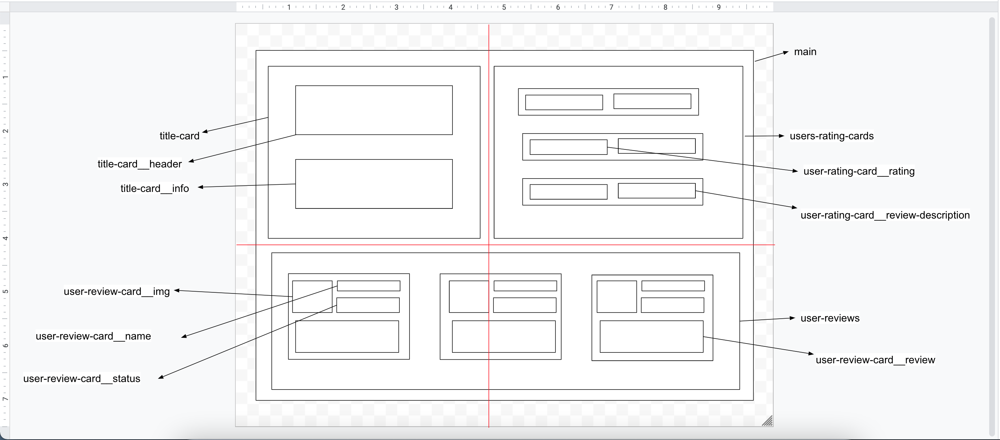
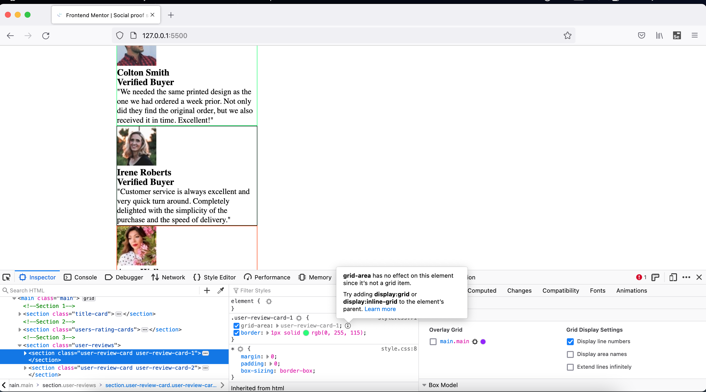

# Frontend Mentor - Social proof section solution

This is a solution to the [Social proof section challenge on Frontend Mentor](https://www.frontendmentor.io/challenges/social-proof-section-6e0qTv_bA). Frontend Mentor challenges help you improve your coding skills by building realistic projects.

## Table of contents

- [Overview](#overview)
  - [The challenge](#the-challenge)
  - [Screenshot](#screenshot)
  - [Links](#links)
- [My process](#my-process)
  - [Built with](#built-with)
  - [What I learned](#what-i-learned)
  - [Continued development](#continued-development)
  - [Useful resources](#useful-resources)
- [Author](#author)
- [Acknowledgments](#acknowledgments)

## Overview

This is 7th project from "Frontend Mentor" to sharpen HTML & CSS skills along with responsive web design and it's build with "BEM" and "Grid layout".

### The challenge

Users should be able to:

- View the optimal layout for the section depending on their device's screen size

### Screenshot

### Links

- [Live Site URL](https://vikramvi.github.io/social-proof-section/)

## My process

### Built with

- Semantic HTML5 markup
- CSS BEM
- CSS Grid
- Mobile-first workflow

### What I learned

- CSS "Grid" & related techniques usage and loads of things related to this technique while solving numerous challanges faced in this project.
- CSS "BEM" is a god given gift to front end developers with which you can change or play around without fearing to break existing working solution.
- Able to solve few complex challenges wrt CSS by Googling and reading different approaches.
- Breaking down big problme into as small chunk as possible, helps to solve it quickly.
- "FF and Chrome dev tools" are your best friends, if something is not working as per your expectations; then look closely to figure out what's exactly is going wrong.
- You can use this tool to play around with properties instead of changing in code itself, saving it and watching preview. This way you can save lots of time as well.

  

### Continued development

- More practice, reading, study is needed wrt BEM, SEO, Accessibility, CSS

### Useful resources

- Google ofcourse
- YT videos
- https://css-tricks.com/snippets/css/complete-guide-grid/
- https://stackoverflow.com/questions/29847009/order-of-font-and-line-height-in-a-rule-set
- https://stackoverflow.com/questions/45536537/centering-in-css-grid
- https://stackoverflow.com/questions/48535585/what-is-difference-between-justify-self-justify-items-and-justify-content-in-cs
- [CSS Grid Tutorial](https://www.youtube.com/playlist?list=PL4cUxeGkcC9itC4TxYMzFCfveyutyPOCY)
- [Mobile-First Responsive Build (with CSS Grid)](https://www.youtube.com/playlist?list=PL4cUxeGkcC9hH1tAjyUPZPjbj-7s200a4)
- [Build Layouts with CSS Grid](https://www.youtube.com/playlist?list=PL4cUxeGkcC9hk02lFb6EkdXF2DYGl4Gg4)
- [Convert px to rem VS Code Plugin](https://marketplace.visualstudio.com/items?itemName=gwanduke.convert-px-to-rem)
- [Are you using the right CSS units?](https://www.youtube.com/watch?v=N5wpD9Ov_To)

## Author

- Frontend Mentor - [@vikramvi](https://www.frontendmentor.io/profile/vikramvi)

## Acknowledgments

- FM community
- Google
- SO community
