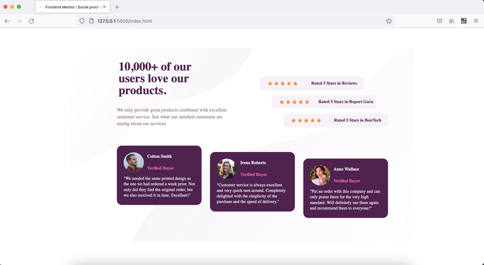
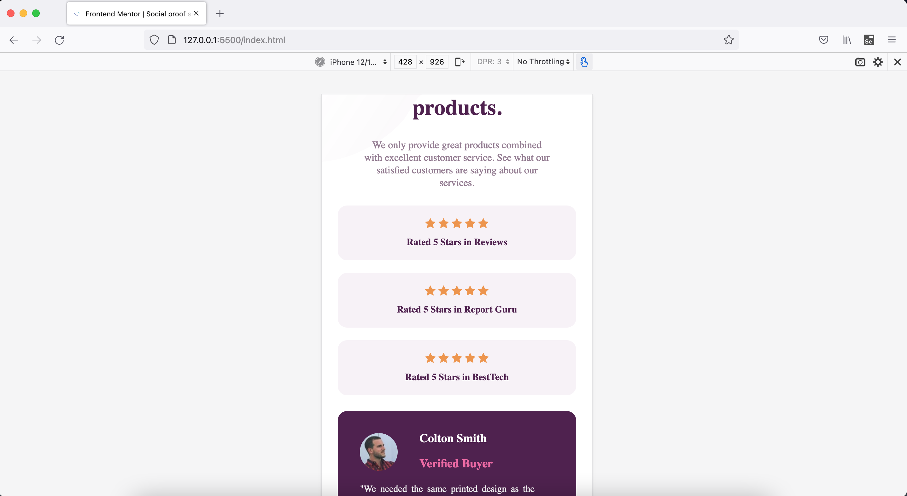

# Frontend Mentor - Social proof section solution

This is a solution to the [Social proof section challenge on Frontend Mentor](https://www.frontendmentor.io/challenges/social-proof-section-6e0qTv_bA). Frontend Mentor challenges help you improve your coding skills by building realistic projects.

## Table of contents

- [Overview](#overview)
  - [The challenge](#the-challenge)
  - [Screenshot](#screenshot)
  - [Links](#links)
- [My process](#my-process)
  - [Built with](#built-with)
  - [What I learned](#what-i-learned)
  - [Continued development](#continued-development)
  - [Useful resources](#useful-resources)
- [Author](#author)
- [Acknowledgments](#acknowledgments)

## Overview

This is 7th project from "Frontend Mentor" to sharpen HTML & CSS skills along with responsive web design and it's build with "BEM" and "Grid layout".

### The challenge

Users should be able to:

- View the optimal layout for the section depending on their device's screen size

### Screenshot

### Links

- [Live Site URL](https://vikramvi.github.io/social-proof-section/)

## My process

### Built with

- Semantic HTML5 markup
- CSS BEM
- CSS Grid
- Mobile-first workflow

### What I learned

- CSS "Grid" & related techniques usage and loads of things related to this technique while solving numerous challanges faced in this project.
- CSS "BEM" is a god given gift to front end developers with which you can change or play around without fearing to break existing working solution.
- Able to solve few complex challenges wrt CSS by Googling and reading different approaches.
- Breaking down big problme into as small chunk as possible, helps to solve it quickly.

### Continued development

- More practice, reading, study is needed wrt BEM, SEO, Accessibility, CSS
